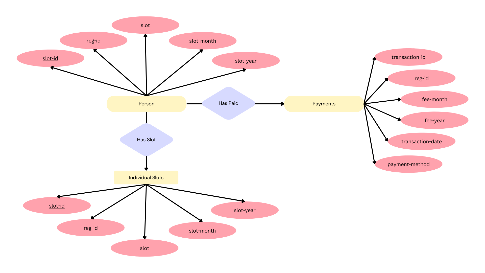
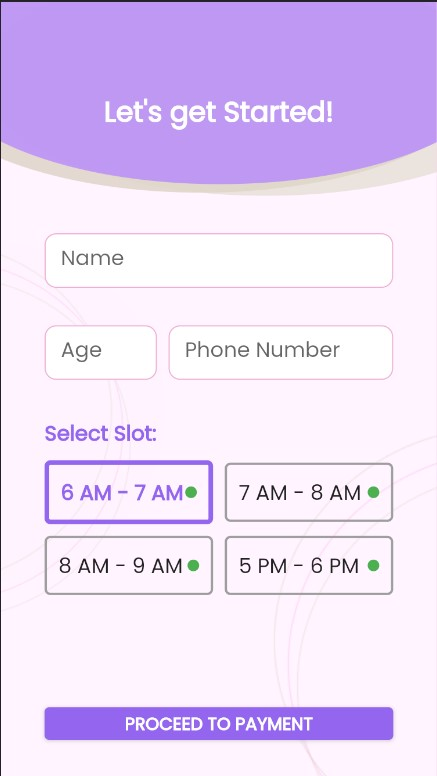
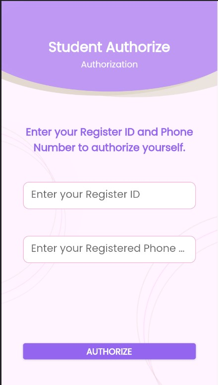
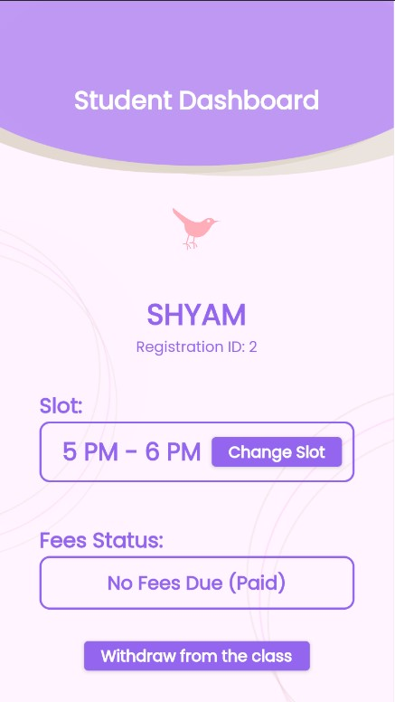
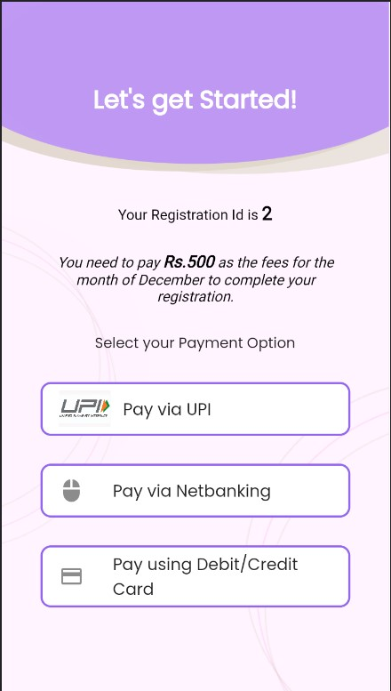
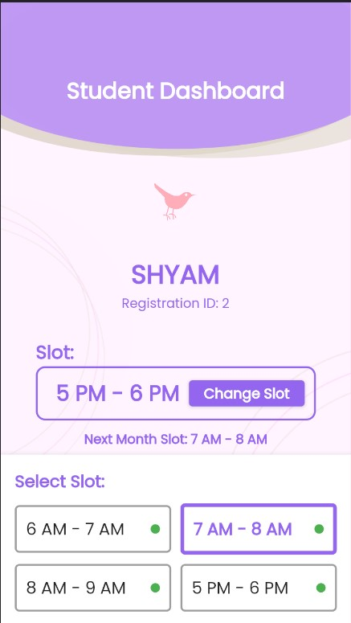
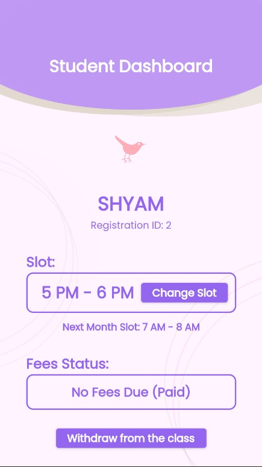

# yogaapp-combined

Yoga App Frontend and backend combined
Made for Flexmoney Internship 2023 Assignment

A Mobile App is made using flutter. It is also deployed as a web app, but the UI is best suited for a mobile.

Working Web App Link: https://yoga-app-f6f3a.web.app/#/ 
Download the mobile app here: [Download apk](app.apk)

Original Frontend Repository: https://github.com/AthulJohn/yogaapp-frontend 
Original Backend Repository: https://github.com/AthulJohn/YogaAPI

<h3>Features:</h3>
This app includes the asked features, that is Registration, Slot Changing, and Fee Payment. 
Apart from that, a small <i>know more</i> screen is included for users to know about the yoga class. 
Also, users can see thier current slot, next month's slot, thier due fees, registration ID etc.

Proper Authentication is not done, but inorder to identify users, Thier Registration Id, as well as phone number is used.

Anothr feature of the app is its slot availability indication. A colored dot will be displayed while slot selection, whose color indicates slots availability, green being available, and red begin not available, with intermediate colors, to show such stages.

<h3>Assumptions Made:</h3>
This app is assumed to be made for an institute named Nirvana Yoga Training.
Also, All the slots is given a limit of 50, and if a slot in a month has 50 registrations, then the slot will be unavailable.

<h3>Database Design:</h3>
3 tables are used for data storage: 
Person table to store the details of people 
Slot Table, to store slot details. 
Transactions Table, to store all transaction details.

ER Diagram:

  
Here, Data is inputed to Person table during the time of registration.  
Data in the slot table is added while registering, and it contains slot details of every user for every month, till the next month. 
During registration, the slot given by the user is set as the current month slot, as well as the next month slot. 
Whenever a user edits slot, only the next month slot is changed.  
Transaction table is updated after every Fee Payment. The last payment of a user will provide the the number of months due to pay.  

<h3>Tech Stacks used:</h3>
Frontend Built using Flutter 
Backend built using Flask,SQLAlchemy 
Database used: PostgreSQL 
API and database hosted on Render.com 
Web App hosted on Firebase

<h3>Known Issues</h3>
Since this project is made as a mobile app, the app faces a couple of issue in the web version
  <ul>
    <li>Restarting a page will cause the data to be removed from the local base. Thus the web app shoud be started from the homescreen to recollect the data.</li>
    <li>The Postgres url is not hidden in the github repository. It should be hidden for security.</li>
  </ul>
  <h5>Authentication Issue</h5>
  Temporarily, authentication, or user identification to be exact, is done using regiteration ID and phone number. But this technique some problems, apart from the existing safety issue.
  <ul>
    <li>A user will be shown his registration id after he register. So he is supposed to remember the ID, and if not, then there is no way to fetch the ID. (ID is shown in the user dashboard, but it requires the user to authorize using the same ID itself!)</li>
  </ul>

<h3>Screenshots:</h3>
  
Home Screen: 
 

Register Page: 
 

Authorize Page: 
 
Dashboard: 
 
Payment Page: 
 
Dashboard Page, when slot is changing: 
 
Dashboard Page, when slot changed: 
 
Know More Page: 
 

